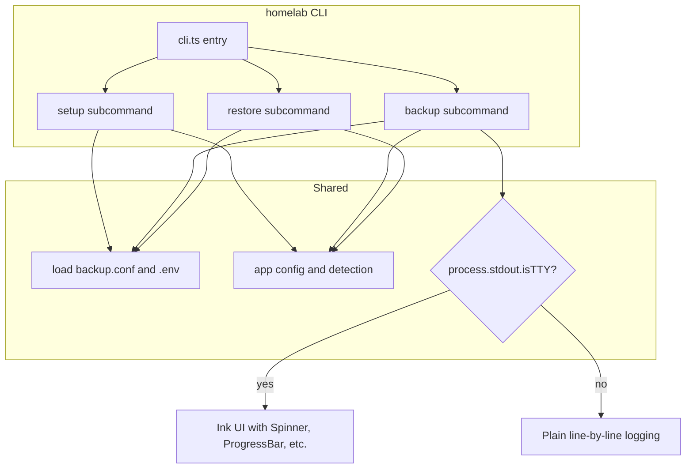

# Homelab → Ink CLI Migration Plan

## 1. Is It Doable? Is It Worth It?

### Ink and @inkjs/ui

Ink provides React components for the terminal. For this project, the following map well to current behavior:

| Current need | Ink / @inkjs/ui | Notes |

|-------------|------------------|-------|

| Yes/No prompts (14+ per setup) | `ConfirmInput` | Replaces `prompt_yes_no` |

| Text input (base dir, DuckDNS, WireGuard, Navidrome) | `TextInput`, `PasswordInput` | Better than `read -rp` |

| Choose apps to install | `Select` or `MultiSelect` | One list instead of 14 y/n |

| Long-running steps (Docker install, tar, rclone) | `Spinner`, `ProgressBar` | Clear “in progress” |

| Success / error / warning | `StatusMessage`, `Alert`, `Badge` | Structured feedback |

| Ordered summaries (URLs, next steps) | `OrderedList`, `UnorderedList` | Matches end of setup.sh |

| Run `sudo`, `docker`, `rclone`, `tar` | `execa` or `child_process.spawn` | Standard pattern; keep stdin separate from Ink’s raw mode |

Ink’s `useStdin().isRawModeSupported` supports non‑TTY: when `process.stdout.isTTY` is false (e.g. systemd), we **do not** render Ink and instead use plain line-by-line logs. So backup-from-systemd stays reliable.

Bun: works with Ink (see [bun-ink-demo](https://github.com/MieszkoGulinski/bun-ink-demo)); `useInput` works as of Bun 1.3.5. Node 18+ also works.

### Worth it?

- **Setup**: High value — one `MultiSelect` for 14 apps, proper `TextInput`/`PasswordInput` for secrets, spinners for installs, clearer layout and errors.
- **Restore**: High value — `Select` for app and date, `ConfirmInput`, progress instead of bare `read -rp`.
- **Backup**: Moderate when run manually (spinner/progress, nicer logs); when run from systemd, we use a non‑Ink “plain” mode, so behavior stays equivalent to today.

Main tradeoffs: **Node or Bun must be installed before the first run**, and the codebase becomes TypeScript/React instead of bash. The project stays manageable if we keep a single `homelab` CLI and shared config/app logic.

---

## 2. Prerequisite: Bun (primary), automated bootstrap

**Default runtime: Bun 1.x** (no TS build step, fast, works on Raspberry Pi ARM64).

Bun install is **automated in as few steps as possible** via a `bootstrap.sh` script and an optional `homelab` launcher.

### How Bun gets installed (minimal steps for the user)

**Official one-liner** (from [bun.sh/docs](https://bun.sh/docs/installation)):

```bash
curl -fsSL https://bun.sh/install | bash
```

- **Linux**: `unzip` is required. On Debian/Ubuntu: `sudo apt install -y unzip` first (or the bootstrap script does this).
- **Result**: Bun in `~/.bun/bin`. User must have `~/.bun/bin` in `PATH` (new login, or `source ~/.bashrc` / `export PATH="$HOME/.bun/bin:$PATH"`).

### Bootstrap script (`bootstrap.sh`)

A single script in the repo that the user runs **once** before `homelab setup`:

1. If `command -v bun` succeeds → print “Bun already installed” and exit (or optionally continue to add PATH to `~/.bashrc` if missing).
2. On Debian/Ubuntu: `sudo apt-get install -y unzip` (idempotent; skip if `unzip` exists).
3. `curl -fsSL https://bun.sh/install | bash`.
4. Ensure `~/.bashrc` (or `~/.profile`) contains:

   - `export BUN_INSTALL="$HOME/.bun"`
   - `export PATH="$BUN_INSTALL/bin:$PATH"`
   - Only append if not already present (grep).

5. Print: “Bun installed. Run: `source ~/.bashrc` (or open a new terminal), then: `bun run homelab setup`.”

**User steps:** (1) Clone repo, (2) run `./bootstrap.sh`, (3) `source ~/.bashrc` (or new terminal), (4) `bun run homelab setup`. Optionally we can reduce to 2 steps with a launcher (below).

### Optional: `homelab` launcher (reduce to 2 steps)

A small **bash** wrapper `homelab` (or `./homelab`) that:

1. If `bun` in PATH → `exec bun run src/cli.ts "$@"`.
2. Else if `node` in PATH → `exec node dist/cli.js "$@"` (fallback, needs `bun run build` first).
3. Else → run `./bootstrap.sh`, then print: “Run `./homelab` again” (or `exec bash -c 'export PATH="$HOME/.bun/bin:$PATH"; ./homelab "$@"'` so the **same** `./homelab setup` continues in a subshell with Bun in PATH).

With the launcher: user runs `./bootstrap.sh` once (or `./homelab` which runs bootstrap if needed), then `./homelab setup` — **2 steps** (or 1 if `./homelab` invokes setup after bootstrap).

### Systemd and PATH

For `homelab-backup.service`, `bun` must be on the service’s PATH. Options:

- Use absolute path: `ExecStart=/home/pi/.bun/bin/bun run /opt/homelab/src/cli.ts backup` (replace with real user and project path).  
- Or ensure `/etc/environment` or a `Environment=PATH=...` in the service includes `~/.bun/bin` (expand `~` to the running user’s home).  
- The `homelab setup` step that writes the service file will use the same user that runs setup (e.g. `$HOME/.bun/bin/bun`).

---

## 3. Architecture



- **One entrypoint**: `homelab setup | backup | restore [options]`.
- **Shared**: Config loader (backup.conf + .env), app list and paths (port of `get_app_config` / `detect_apps` from [backup.sh](backup.sh) and [restore.sh](restore.sh)).
- **TTY**: For `backup`, if `!process.stdout.isTTY` (e.g. systemd timer): no Ink, only plain logs. For `setup` and `restore`, interactive use is assumed; we can later add `--yes`/non‑TTY handling if needed.

---

## 4. Suggested Repo Layout

```
homelab/
├── package.json
├── tsconfig.json
├── bootstrap.sh         # One-time Bun install: unzip, curl|bash, add PATH to ~/.bashrc
├── homelab              # Optional: bash launcher; runs bootstrap if no bun, then bun run src/cli.ts
├── src/
│   ├── cli.ts           # Entry: parse argv → setup | backup | restore
│   ├── config.ts        # backup.conf + .env, BASE_DIR, etc.
│   ├── apps.ts          # App definitions, get_app_config, detect_apps
│   ├── setup/
│   │   └── SetupApp.tsx # Ink setup flow
│   ├── backup/
│   │   └── backup.ts    # Backup logic + Ink (TTY) or plain (no TTY); rclone + N-of-M progress
│   └── restore/
│       └── RestoreApp.tsx
├── backup.conf          # Kept; still source of truth for backup/restore
├── .env                 # Kept; used by config loader
├── setup.sh             # Legacy; keep until Ink CLI is proven
├── backup.sh            # Legacy; keep for rollback; systemd uses new CLI (Option A)
└── restore.sh           # Legacy; keep for rollback
```

The existing [backup.conf](backup.conf) and `.env` stay; the CLI reads them via `config.ts`.

---

## 5. Migration Steps

### Step 1: Project bootstrap

- Create `package.json` with: `ink`, `react`, `@inkjs/ui`, `execa`, and `@types/react`. Prefer TypeScript.
- Add `tsconfig.json` (Bun can run TS directly; optional `build` for Node fallback).
- **Primary script**: `"homelab": "bun run src/cli.ts"` (Bun). Optional: `"build": "bun build src/cli.ts --outdir=dist"` or `tsc` for a Node-friendly `dist/cli.js`.
- Create **`bootstrap.sh`** (see Section 2): install `unzip` if needed, run `curl -fsSL https://bun.sh/install | bash`, add `BUN_INSTALL`/`PATH` to `~/.bashrc` if missing. Optional: **`homelab`** bash launcher that runs `bootstrap.sh` when `bun` is missing, then `bun run src/cli.ts "$@"`.
- Document in README: Bun 1.x (primary); run `./bootstrap.sh` once, then `bun run homelab setup`.

### Step 2: Shared core

- **config.ts**: Parse `backup.conf` (or equivalent key=value), load `.env` from script dir; resolve `BASE_DIR` (backup.conf → .env → error). Expose `BACKUP_DIR`, `LOCAL_RETENTION`, `REMOTE_RETENTION`, `RCLONE_REMOTE`, `APPS`.
- **apps.ts**: Port `get_app_config` and `detect_apps` from [backup.sh](backup.sh) (lines 67–154) and [restore.sh](restore.sh) (lines 60–123). Keep the same app→path/compose layout so backup/restore behavior is unchanged.

### Step 3: CLI entry and routing

- **cli.ts**: Parse `setup | backup | restore` and flags (e.g. `--yes` for setup/restore, `--no-tty` or `--plain` for backup if we want an explicit override). Call the right module. Use a small parser (e.g. `process.argv` or `yargs`/`commander`) so we can add `--config`, `--base-dir`, etc. later.

### Step 4: Setup command (Ink)

- **SetupApp.tsx**:  
  - Steps: (1) detect distro (reuse logic from [setup.sh](setup.sh) `detect_linux_distro` via `execa`/spawn), (2) install Docker if missing, (3) install rclone if missing, (4) base dir (`TextInput` or from `.env`), (5) app selection (`MultiSelect` over the 14 apps from `apps.ts`), (6) for each selected app that needs secrets: `TextInput`/`PasswordInput` (DuckDNS, WireGuard, Navidrome, etc.).  
- Run all “system” commands with `execa('sudo', ['bash', '-c', cmd])` or `execa('sudo', ['docker', ...])`. Show `Spinner` + short label during each long step; on failure, show `StatusMessage` or `Alert` and exit.  
- For WireGuard QR: `execa('sudo', ['docker', 'exec', 'wireguard', 'qrencode', '-t', 'ansiutf8'], { stdin: readFileSync(peerConf) }) `and render the stdout in a `<Static>` or via `useStdout().write` so the QR stays visible.  
- At the end: `OrderedList`/`UnorderedList` of URLs and notes, as in [setup.sh](setup.sh) (lines 754–795).  
- `--yes`: skip all prompts; use `BASE_DIR` from env/config and install all apps (or a fixed default set) with env-provided secrets only; show only spinners and final summary.

### Step 5: Backup command (Ink when TTY, plain when not)

- **backup.ts** (or a `BackupApp.tsx` used only when TTY):  
  - Reuse `config.ts` and `apps.ts`. Port from [backup.sh](backup.sh): `backup_app`, `backup_secrets`, `rotate_local_backups`, `upload_to_remote`, `rotate_remote_backups`.  
- If `process.stdout.isTTY`: render an Ink UI with **ProgressBar** and/or **Spinner**; append the same messages to a log file (e.g. `/var/log/homelab-backup.log`).  
- If `!process.stdout.isTTY`: do **not** call `render()`; run the same backup logic and `console.log` (or a `log()` that writes to stdout + file) line-by-line. This is what systemd will use.  
- Keep the same paths, tarball names, and rclone layout as today so existing restores and systemd timers keep working.

**ProgressBar strategy (TTY):**

- **During “Backing up app 1..N” and “Backing up secrets”**: Use **“N of M”** (e.g. “App 3 of 8”) to drive a `ProgressBar`: `value = (N / M) * 100`. M = number of apps + 1 (secrets). Fallback: simple `Spinner` with “Backing up app X…” if we don’t have M up front.
- **During “Uploading to remote” (rclone)**: Prefer **rclone-driven progress**:
  - Spawn `rclone copy ... --progress --stats 1s` with stderr (and stdout if needed) piped.
  - Parse lines for the last `(\d+)%` (rclone prints e.g. `Transferred: 1.234 GiB / 5.678 GiB, 22%, …`). Use that as `ProgressBar` 0–100. When rclone exits 0 with no prior `%`, treat as 100%.
  - **Fallback**: If parsing fails or rclone skips progress (e.g. 0 bytes): use an indeterminate `Spinner` or a step-based “Uploading… (phase 3 of 4)”.
- **During “Rotate local” / “Rotate remote”**: `Spinner` or step-based “Step 4 of 4” is enough.

### Step 6: Restore command (Ink)

- **RestoreApp.tsx**:  
  - `Select` for target: app names from `apps.ts` + “full”.  
  - `Select` for date: “latest” + list of `BACKUP_DIR/archive/*` and, if implemented, remote dates via `rclone lsd`.  
  - `ConfirmInput`: “This will stop the container, replace config, and restore. Continue?”  
  - Run the same steps as [restore.sh](restore.sh): `find_backup` (local then remote), `stop_container`, remove config dir, `tar -xf`, `start_container`. Use `execa` for `sudo docker` and `tar`. Show `Spinner` during each app and a final `StatusMessage`.  
  - `--yes`: skip `ConfirmInput`; require `app` and optional `date` in argv.

### Step 7: Systemd and backup.service (Option A)

- Systemd runs the new CLI in non‑TTY mode. The backup logic uses plain logging when `!isTTY`, so no Ink is involved.
- **ExecStart** (Bun): use the **absolute path to `bun`** and to the project, e.g.  

`ExecStart=/home/pi/.bun/bin/bun run /home/pi/homelab/src/cli.ts backup`

(Replace `pi` and `/home/pi/homelab` with the actual user and project path. The `homelab setup` step that writes the service will derive these from `$HOME` and `path.dirname` of the CLI.)

- **WorkingDirectory**: project root (e.g. `/home/pi/homelab`) so `backup.conf` and `.env` resolve correctly.
- **User**: `root` (as in the current [setup.sh](setup.sh) `homelab-backup.service`); then `bun` must be under `/root/.bun/bin` if the setup user is root, or set `Environment="PATH=/home/pi/.bun/bin:..."` so the service finds `bun`. Prefer: run `homelab setup` as the same user that will own the service; if the service is `User=root`, either install Bun for root (run `bootstrap.sh` as root) or use a `User=pi` service and `ExecStart=/home/pi/.bun/bin/bun ...`.

### Step 8: Wiring setup to the backup timer

- When `homelab setup` configures the backup timer, it should:
  - Write `homelab-backup.service` with `ExecStart` pointing at the new CLI (e.g. `$HOME/.bun/bin/bun run /path/to/src/cli.ts backup`) and `WorkingDirectory` set to the project root.  
- Reuse the same timer spec as today (e.g. OnCalendar 02:00, Persistent, RandomizedDelaySec).  
- `homelab-backup.service` should use the real path to the built (or source) CLI; `SCRIPT_DIR`/`__dirname` in the JS/TS can be used to derive that path.

### Step 9: Testing and docs

- Test:  
  - `homelab setup` and `homelab setup --yes` (with/without Docker and rclone).  
  - `homelab backup` in a TTY (Ink) and with `stdout` piped or from a service (plain).  
  - `homelab restore <app>` and `homelab restore full` with `--yes` and interactive.  
- Run once under Node and once under Bun if both are supported.  
- Update README: install of Node/Bun, `bun run homelab setup` (or `node dist/cli.js setup`), and that systemd uses the same `homelab backup` in a non‑TTY environment.

---

## 6. Design Choices (Confirmed)

1. **Bun as default**: Bun is the primary runtime (no TS build, works on Pi ARM64). Node remains a fallback if we add a `homelab` launcher.
2. **Systemd: one backup implementation (Option A)** — clarified:

   - **Option A (chosen)**: The **same** TypeScript backup runs for both manual `homelab backup` and the systemd timer. When the timer fires, systemd runs e.g. `~/.bun/bin/bun run /path/to/src/cli.ts backup`. The CLI sees `!process.stdout.isTTY` and uses **plain line-by-line logging** (no Ink). So: one codebase; systemd *does* need Bun on PATH (or absolute path to `bun`).
   - **Option B (hybrid, not chosen)**: Keep the old `backup.sh` for systemd. The new Ink CLI is only used when you run `homelab setup`, `homelab restore`, or `homelab backup` **by hand** in a terminal. Systemd would keep calling `bash /path/to/backup.sh`. Benefit: systemd does **not** need Bun. Drawback: two different backup implementations to maintain.

3. **Bootstrap**: Bun install is **automated** via `bootstrap.sh` (and optionally a `homelab` launcher) so the user has as few steps as possible (see Section 2).
4. **Backup progress**: **Rclone-driven ProgressBar** during upload when possible; **“N of M” apps** for the tar/backup phase; fallback to Spinner or step-based if rclone can’t be parsed (see Step 5).

---

## 7. Risk and Rollback

- **Risks**: Node/Bun dependency, possible `execa`+raw-mode edge cases (mitigated by not using `useInput` during long `execa` runs and by using plain mode when !TTY).  
- **Rollback**: Keep the current [setup.sh](setup.sh), [backup.sh](backup.sh), [restore.sh](restore.sh), and [backup.conf](backup.conf) until the Ink CLI is proven. We can switch the systemd service back to `backup.sh` by changing `ExecStart` and leaving the timer as is.

---

## 8. Suggested Order of Work

1. Bootstrap project (package.json, tsconfig, deps, `homelab` script) and **`bootstrap.sh`** (Bun install + PATH). Shared `config` + `apps`.  
2. Implement `backup` with TTY/plain branching, rclone + N-of-M ProgressBar, and port of existing backup logic.  
3. Implement `restore` in Ink.  
4. Implement `setup` in Ink (largest piece).  
5. Update systemd service and `setup`’s “setup backup timer” step to use the new CLI (Bun path, WorkingDirectory).  
6. README (Bun, `./bootstrap.sh`, `bun run homelab setup`), testing, and optional `homelab` launcher.

This order validates backup (including non‑TTY) and restore early, then tackles the more complex setup flow.